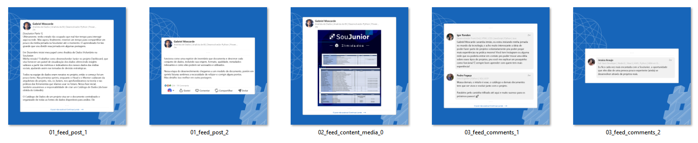
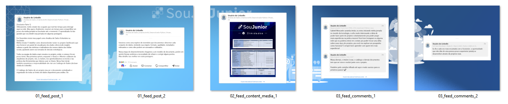

# Python Post Maker
Este projeto consiste em uma aplicação Python que realiza web scraping em postagens do LinkedIn e, em seguida, processa os dados coletados para gerar imagens formatadas para postagem no Instagram ou outras redes.

## ⚙️ Funcionalidades

- ✅ `Web Scraping`: Extrai dados de perfis do LinkedIn a partir de URLs fornecidas.
- ✅ `Processamento de Imagens`: Formata os dados coletados em imagens prontas para serem compartilhadas.
- ✅ `Configurações Personalizadas`: Permite carregar configurações customizadas ou usar configurações padrão.
    - ✅ `Background Personalizado`: Permite escolher uma imagem de fundo personalizada.
    - ✅ `Background Carrossel Personalizado`: Permite ativar o carrossel de imagens personalizado veja exemplos em `assets/backgrounds/carrossel`.
    - ✅ `Autores Anônimos`: Permite substituir os nomes dos autores e dos comentários por valores anônimos.

## 🖥️ Screenshots
<center>
 
Anon=False | Background=Default


Anon=True | Background=Carrossel | soujunior_1-8
</center>

## 🧰 Bibliotecas

- `Selenium`: Navegação, interação e raspagem de dados
- `BeautifulSoup`: Manipulação de dados HTML
- `Pillow`: Manipulação de imagens
- `yaml`: Leitura de arquivos YAML

## ⬇️ Como usar

1. Clone ou faça o download do repositório no seu computador..

2. Navegue até o diretório onde o script está localizado.

3. Execute o script com o seguinte comando:


```shell
 python app.py
```

4. Interacione com a interface de linha de comando passando a(s) URL(s) para o script.

5. Ao fim é aberto a pasta de saída com as imagens formatadas e os dados coletados brutos.


## 📋 Pré-requisitos

Antes de usar iniciar o script localmente, certifique-se de ter os seguintes pré-requisitos:

- Python 3.x instalado no seu sistema.
- Ter as bibliotecas instaladas. Você pode instalar usando o comando:

``` shell
pip install -r requirements.txt
```

## ⌛ Progresso e metas de desenvolvimento

- [x] Realizar a coleta de dados abrangendo diferentes tipos de postagem e midias.
- [x] Gerar imagens formatadas para compartilhamento
- [x] Função para anonimizar os usuários
- [x] Criar uma interface de linha de comando
- [x] Possibilitar configurações customizações(backgrounds)
- [ ] Criar uma interface visual (web)
- [ ] Gerar imagens no formato vertical
- [ ] Mais opções de backgrounds no pacote


E talvez algumas funcionalidades a mais, sinta-se a vontade para contribuir com o projeto 😅.

## ⭐ EsmolaPill

Gostou do projeto? Você pode contribuir com uma ⭐️ aqui no repositório no repositório!

## 💬 Vamos conectar?

<div align="left">
  <a href="https://linkedin.com/in/moscarde" target="_blank">
    
  </a>
  <a href="https://github.com/moscarde" target="_blank">
  </a>
</div>